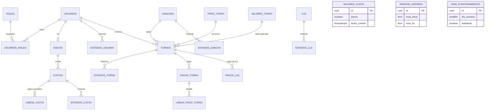

# AdmCanchasTenis — Diseño del esquema de base de datos

> Diseño derivado de `docs/DOMINIO.md` (modelo de análisis, pág. 18 del PDF de cátedra)
> y `docs/CONTEXTO.md`. Migración inicial:
> `supabase/migrations/20260925000000_initial_schema.sql`.
> PostgreSQL 15+ (compatible con Supabase). Sin Supabase Auth: la tabla `usuarios`
> es propia de la aplicación y la autenticación se resuelve en la API con JWT.

## 1. Convenciones

- **Claves primarias**: UUID con `gen_random_uuid()` en todas las tablas. Cada OID del
  diagrama de clases se mapea a un UUID; los identificadores de negocio que en el
  diagrama eran OID (`numeroSocio`, `numeroLinea`) quedan como columnas de negocio con
  `unique` donde corresponde.
- **Nombres**: tablas en plural y `snake_case`; columnas en singular y `snake_case`;
  dominio en español, sin acentos en identificadores.
- **Dinero**: `numeric(12, 2)` con `check >= 0` en todo monto o costo.
- **Fechas y horas**: `fecha date` y `hora_inicio`/`hora_fin time` se interpretan en la
  hora local del club (sin zona horaria propia). Los timestamps de auditoría,
  historial y pagos usan `timestamptz`.
- **Auditoría**: `created_at`/`updated_at timestamptz not null default now()` en las
  tablas principales. `updated_at` lo mantiene la API (no hay trigger). Las tablas de
  historial usan únicamente su timestamp de dominio (`fecha_hora`, `fecha_cambio`,
  `fecha`, `fecha_y_hora`).
- **Borrado**: `on delete restrict` para referencias entre entidades; `on delete cascade`
  para hijos directos (líneas de pago e historiales). La baja de usuarios es lógica
  (`usuarios.estado_actual = 'inactivo'`, RF-7), por lo que no se esperan borrados duros.
- **Normalización de texto**: `username` y `email` se guardan en minúsculas y únicos;
  la normalización es responsabilidad de la API (no se usa `citext`).

## 2. Mapa clase → tabla

### 2.1 Usuarios y roles

| Clase en DOMINIO.md | Objeto en el esquema | Notas |
|---|---|---|
| Usuario | `usuarios` (`id`, `username`, `password_hash`, `email`, `nombre`, `apellido`, `telefono`, `dni`, `estado_actual`) | `password` (diagrama) se materializa como `password_hash`; la API aplica bcrypt/argon2. `estado_actual` es la fuente única de estado del usuario. |
| Socio | `socios` (`id`, `numero_socio`, `fecha_alta`, `usuario_id`) | Asociación 0..1 con `usuarios`; `numero_socio` y `usuario_id` son `unique`. `Socio.estado` del diagrama queda cubierto por `usuarios.estado_actual` (sin doble fuente). |
| EstadoUsuario | `estados_usuario` (`usuario_id`, `valor`, `fecha_hora`) | Historial append-only. |
| EstadoUsuario.valor (enum) | enum `estado_usuario` | `activo`, `moroso`, `suspendido`, `inactivo`. |
| Rol | `roles` (`id`, `nombre`) | PK UUID; `nombre` es el FK target. |
| Rol.nombre (enum) | enum `rol_nombre` | `admin`, `socio`, `no_socio` (etiquetas de negocio: Admin, Socio, No socio). |
| UsuarioRol | `usuarios_roles` (`usuario_id`, `rol_id`, `fecha_inicio`, `fecha_fin`) | `fecha_fin` null = rol vigente; índice único parcial: un solo rol vigente por usuario. |

### 2.2 Cuotas

| Clase en DOMINIO.md | Objeto en el esquema | Notas |
|---|---|---|
| Cuota | `cuotas` (`id`, `socio_id`, `fecha_inicio`, `fecha_vencimiento`, `monto_total`, `estado_actual`) | `unique (socio_id, fecha_inicio)` habilita la generación mensual idempotente (RF-20). |
| LineaCuota | `lineas_cuota` (`id`, `cuota_id`, `numero_linea`, `fecha_pago`, `monto`, `estado`) | Pagos parciales (RN-3); `unique (cuota_id, numero_linea)`. |
| ValorCuota | `valores_cuota` (`id`, `precio`, `fecha_cambio`) | Tarifas históricas. |
| EstadoCuota | `estados_cuota` (`cuota_id`, `valor_estado`, `fecha_hora`) | Historial append-only; cache en `cuotas.estado_actual`. |
| EstadoCuota.valorEstado (enum) | enum `estado_cuota` | `pendiente`, `pagada`, `parcial`, `adeudada`, `cancelada`. |

### 2.3 Turnos

| Clase en DOMINIO.md | Objeto en el esquema | Notas |
|---|---|---|
| Turno | `turnos` (`id`, `usuario_id`, `cancha_id`, `tipo_turno_id`, `valor_turno_id`, `fecha`, `hora_inicio`, `hora_fin`, `costo_turno_ns`, `requiere_luz`, `estado_actual`, `estado_pago`, `cantidad_personas`, `cantidad_no_socios`) | `unique (cancha_id, fecha, hora_inicio)`; `costo_turno_ns` es el costo para no socios congelado en la reserva. |
| TipoTurno | `tipos_turno` (`id`, `duracion_max`) | Duración en minutos; seeds 60 y 90. |
| ValorTurno | `valores_turno` (`id`, `costo_x_hora`, `fecha_cambio`) | Tarifas históricas. |
| EstadoTurno | `estados_turno` (`turno_id`, `valor_estado`, `valor_estado_pago`, `motivo`, `fecha_y_hora`) | Historial combinado: cada fila es la foto del par (ciclo de vida, pago) tras una transición. |
| EstadoTurno.valorEstado (enum) | enums `estado_turno` + `estado_pago` | El enum de cátedra se separa en dos ejes (ver sección 4). |
| PagoTurno | `pagos_turno` (`id`, `turno_id`, `monto_total_turno`, `fecha_pago`) | Pago de turno (no socio). |
| LineasTurnoPago | `lineas_pago_turno` (`id`, `pago_turno_id`, `monto_turno_pago`) | Detalle del pago. |

### 2.4 Canchas y luz

| Clase en DOMINIO.md | Objeto en el esquema | Notas |
|---|---|---|
| Cancha | `canchas` (`id`, `nro_cancha`, `superficie`, `iluminacion`, `estado_actual`) | `nro_cancha` único. |
| EstadoCancha | `estados_cancha` (`cancha_id`, `valor_state`, `fecha_cambio`, `motivo`) | `Descripcion` del diagrama se materializa como `motivo` (RF-17). |
| EstadoCancha.suelo (enum) | enum `superficie_cancha` sobre `canchas.superficie` | `dura`, `polvo_de_ladrillo`, `cesped`. Dato estático, no histórico. |
| EstadoCancha.valorState (enum) | enum `estado_cancha` sobre `canchas.estado_actual` y `estados_cancha.valor_state` | `disponible`, `en_mantenimiento`, `inhabilitada`. |
| Luz | `luz` (`id`, `costo_x_hora`, `franja_horario_inicio`, `franja_horario_fin`) | Configuración vigente (una fila operativa). `iluminacion` estático vive en `canchas`. |
| EstadoLuz | `estados_luz` (`luz_id`, `costo_x_hora`, `fecha`) | Historial de tarifa de luz. |
| PagoLuz | `pagos_luz` (`id_pago_luz`, `turno_id`, `monto_total_luz`, `fecha_pago`) | PK propia `id_pago_luz`; corrige la colisión del diagrama. |

### 2.5 Configuración general

| Clase en DOMINIO.md | Objeto en el esquema | Notas |
|---|---|---|
| RangoHorario | `rangos_horario` (`id`, `nombre`, `hora_inicio`, `hora_fin`) | Franja genérica (apertura, iluminación). `check (hora_fin > hora_inicio)`. |
| DiaFuncionamientoClub | `dias_funcionamiento` (`id`, `dia_semana`, `habilitado`) | `dia_semana` ISO-8601 (1 = lunes, 7 = domingo), único. |

## 3. Decisiones clave

1. **OID → UUID**: todas las PK son UUID con `gen_random_uuid()` (built-in desde
   PostgreSQL 13; no requiere extensión). Los identificadores de negocio del diagrama
   se conservan como columnas únicas (`numero_socio`, `numero_linea`, `nro_cancha`).
2. **Patrón historial + caché**: `estados_usuario`, `estados_cuota`, `estados_cancha` y
   `estados_turno` son tablas append-only; la entidad principal expone el estado
   corriente en `estado_actual` (y `estado_pago` en turnos). Motivo: lecturas rápidas
   de los paths calientes sin recorrer el historial, y trazabilidad completa para
   estadísticas (RF-32, RF-45). Invariante: la historia y el caché se escriben en la
   misma transacción y el estado solo se muta por un único método de transición del
   caso de uso; nunca por asignación directa.
3. **Ciclo de vida vs pago del turno**: `turnos.estado_actual` usa `estado_turno`
   (`confirmado`, `cancelado`, `iniciado`, `finalizado`, `no_asistio`) y
   `turnos.estado_pago` usa `estado_pago` (`impago`, `pago`). `estados_turno` guarda
   la foto combinada de ambos ejes después de cada transición, de modo que se puede
   reconstruir cualquiera de las dos líneas de tiempo. El mapeo desde el enum de
   cátedra está en la sección 4.
4. **PagoLuz con PK propia**: `pagos_luz.id_pago_luz` corrige el typo del diagrama,
   que reutilizaba `idLineaTurnoPago`. Las líneas de detalle (`lineas_pago_turno`)
   conservan su propia PK y FK a `pagos_turno`.
5. **Superficie e iluminación estáticas**: `EstadoCancha.suelo` pasa a
   `canchas.superficie` y la iluminación a `canchas.iluminacion`; no forman parte del
   historial porque no son estados.
6. **Estado del socio en el usuario**: `socios` no duplica `estado`; la fuente única
   es `usuarios.estado_actual` + `estados_usuario`. Esto cubre `Socio.estado` del
   diagrama sin doble escritura.
7. **Un rol vigente por usuario**: índice único parcial
   `uq_usuarios_roles_vigente` sobre `usuarios_roles (usuario_id) where fecha_fin is null`.
   Permite historial completo y evita asignaciones abiertas simultáneas.
8. **Tarifas versionadas**: `valores_turno`, `valores_cuota` y `estados_luz` acumulan
   filas con `fecha_cambio`/`fecha`. Tarifa vigente:
   `select * from valores_turno where fecha_cambio <= now() order by fecha_cambio desc limit 1`
   (análogo para cuota y luz). `luz.costo_x_hora` mantiene el valor corriente para
   lectura directa.
9. **Índices por read path**: agenda `(fecha, cancha_id)`; conteo RN-2
   `(usuario_id, fecha)`; cuotas `(socio_id, estado_actual)`; pagos por fecha;
   historiales `(entidad_id, timestamp desc)`; FK que se usan en joins.
10. **Timestamps**: `created_at`/`updated_at` en tablas principales con default
    `now()` y mantenimiento en la API; el historial usa su timestamp de dominio.
11. **`motivo` en transiciones**: `estados_turno.motivo` (cancelación con motivo,
    CU22/CU24) y `estados_cancha.motivo` (RF-17).
12. **Datos de composición del turno**: `cantidad_personas` y `cantidad_no_socios`
    soportan el formulario de CU04 y el cálculo del costo de no socios.
13. **Unicidad `(socio_id, fecha_inicio)`**: evita duplicar la cuota mensual si se
    reintenta la generación automática (RF-20).
14. **Tabla `luz` en singular**: es un nombre de masa invariable; se aparta de la
    convención de plural para mantener el nombre de la clase.

## 4. Mapeo del enum EstadoTurno de cátedra

| Valor de cátedra | Columna | Valor almacenado |
|---|---|---|
| Confirmado | `turnos.estado_actual` | `confirmado` |
| Cancelado | `turnos.estado_actual` | `cancelado` |
| Iniciado | `turnos.estado_actual` | `iniciado` |
| Finalizado | `turnos.estado_actual` | `finalizado` |
| No Asistió | `turnos.estado_actual` | `no_asistio` |
| Impago | `turnos.estado_pago` | `impago` |
| Pago | `turnos.estado_pago` | `pago` |

`estados_turno` registra ambos valores en cada fila (`valor_estado`,
`valor_estado_pago`) como snapshot del estado combinado posterior a la transición.
Al crear un turno se inserta la fila inicial (`confirmado`, `impago`).

## 5. Lo que queda en la capa de aplicación

- **RN-1** (cancelación hasta 1 hora antes), **RN-2** (máximo 2 turnos por día),
  **RN-9** (tope por deuda), **RN-10** (admin sin límite) y **RN-11** (anticipación
  máxima de 1 día): validaciones del servicio de reservas. El esquema solo aporta los
  índices de conteo.
- **Superposición de turnos de 90 vs 60 minutos**: no se expresa como constraint
  (requeriría `EXCLUDE` con `btree_gist`); se valida en el servicio dentro de una
  transacción. `unique (cancha_id, fecha, hora_inicio)` solo cubre inicios idénticos.
- **Transiciones de estado y cálculo de estados de cuota** (pendiente → parcial →
  pagada/adeudada): las decide el servicio según los pagos registrados y las escribe
  junto con su historial.
- **Generación automática de cuotas mensuales** (RF-20): el servicio crea la cuota y
  su estado inicial; la unicidad `(socio_id, fecha_inicio)` hace idempotente el
  reintento.
- **Autenticación y autorización** (RF-2, RF-46, RNF-2): hash de password, emisión y
  validación de JWT, y chequeo de rol vigente en `usuarios_roles`.
- **Registro de pagos ya verificados**: los comprobantes llegan por WhatsApp y el
  admin carga el pago (RF-19, RF-21, RF-33). No hay estado de verificación ni pasarela
  de pago (decisión consciente, nota 6 de DOMINIO.md).
- **`updated_at`**: lo actualiza la API en cada escritura.
- **Normalización de `username`/`email`** a minúsculas antes de insertar.

## 6. Diagrama entidad-relación (compacto)



`valores_cuota`, `rangos_horario` y `dias_funcionamiento` no tienen FK: son tablas de
configuración o tarifas de referencia.

## 7. Notas de arquitectura de DOMINIO.md §7

| Nota | Dónde se resuelve |
|---|---|
| 1. `estadoActual` como caché del último `EstadoTurno`, misma transacción, transición única | `turnos.estado_actual` + `turnos.estado_pago` + `estados_turno`; invariante documentada en el comentario de columna y en la decisión 2 de la sección 3. |
| 2. RN-2 y RN-9 van en aplicación, sin entidad | Sección 5; índices `idx_turnos_usuario_fecha` y `idx_cuotas_socio_estado`. |
| 3. Typo de `PagoLuz` (`idLineaTurnoPago`) | `pagos_luz.id_pago_luz` como PK propia; comentario en la columna. |
| 4. Separar ciclo de vida de pago | Enums `estado_turno` y `estado_pago`; historial combinado en `estados_turno`; sección 4. |
| 5. `suelo`/superficie es dato estático | `canchas.superficie` (enum `superficie_cancha`); no está en `estados_cancha`. |
| 6. Pagos ya verificados por el admin | Sin columnas de verificación ni pasarela; sección 5. |
| 7. Costo del patrón historial | Caché de estado corriente + índices por `(entidad_id, timestamp desc)` para el historial. |

## 8. Cómo aplicar la migración

Con Supabase CLI (recomendado):

```bash
supabase init                            # crea supabase/config.toml (una sola vez)
supabase link --project-ref <project-ref>
supabase db push
```

`supabase db push` detecta `supabase/migrations/20260925000000_initial_schema.sql` y la
aplica en orden. Para desarrollo local: `supabase start` y luego `supabase db reset`
(recrea la base y aplica todas las migraciones). Para ver el historial:
`supabase migration list`.

Alternativa sin CLI: copiar el contenido del archivo en el SQL Editor del panel de
Supabase y ejecutarlo. El script es DDL plano y se ejecuta de arriba hacia abajo; los
`insert ... on conflict do nothing` de los seeds son idempotentes.

## 9. RLS (pendiente)

RLS **no** se habilita en esta migración: la API accede con service role y es la única
vía de acceso a datos (el frontend nunca toca la base). Como paso futuro:

1. `alter table <tabla> enable row level security;`
2. Policies por rol de aplicación. Como no se usa Supabase Auth, `auth.uid()` no
   aplica: el contexto del usuario debe viajar en claims propios del JWT de la API o
   mediante `SET LOCAL` dentro de la transacción.
3. Mientras RLS esté deshabilitado, no exponer la base ni las API keys con acceso
   directo a clientes.

## 10. Riesgos y pendientes

- La superposición fina de turnos (90 vs 60 minutos) depende de la transacción del
  servicio de reservas; conviene considerar aislamiento serializable o advisory locks
  por cancha y fecha si aparece contención.
- `luz` es de una sola fila operativa; no hay constraint de singleton en la base.
- Los enums requieren `alter type ... add value` si el club incorpora estados nuevos.
- `dia_semana` usa ISO-8601; cualquier conversión desde `Date.getDay()` de JavaScript
  (0 = domingo) debe hacerse en la API.
